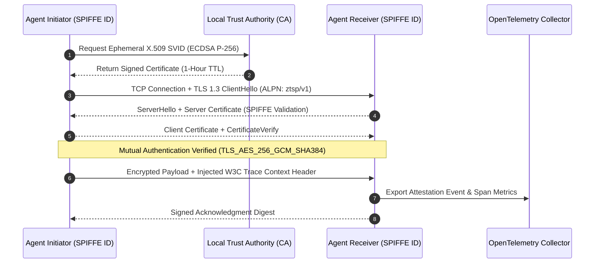

# Zero-Trust Swarm Protocol (ZTSP)

> Cryptographically verifiable, mutual-TLS (mTLS 1.3) inter-agent communication layer with SPIFFE workload attestation and OpenTelemetry distributed tracing.

[](https://go.dev/)
[](https://en.wikipedia.org/wiki/Mutual_authentication)
[](https://spiffe.io/)
[](LICENSE)

---

## Overview

In modern multi-agent systems, agents frequently communicate across open HTTP/REST endpoints or unencrypted message brokers. This architecture is vulnerable to:
1. **Unauthenticated Agent Spoofing**: Rogue agents injecting fraudulent actions into swarm workflows.
2. **Man-In-The-Middle (MITM) Interception**: Cleartext eavesdropping on confidential reasoning chains and API tokens.
3. **Privilege Escalation**: Compromised agents querying higher-privileged nodes without cryptographic attestation.

**Zero-Trust Swarm Protocol (ZTSP)** eliminates implicit network trust between autonomous agents. Every agent process is bound to a cryptographically validated **SPIFFE ID** and must authenticate all inbound and outbound transactions via short-lived X.509 certificates over TLS 1.3.

---

## Protocol Architecture



---

## Core Capabilities

- **Strict mTLS 1.3 Handshakes**: Ciphers are restricted to `TLS_AES_256_GCM_SHA384` and `TLS_CHACHA20_POLY1305_SHA256` with forward secrecy (ECDHE).
- **SPIFFE Workload Attestation**: Enforces structured trust domains (`spiffe://swarm.local/agent/<agent-name>`) embedded in X.509 Subject Alternative Names (SANs).
- **Distributed Observability**: Integrates OpenTelemetry W3C Trace Context directly into packet envelopes to track multi-agent execution traces.
- **Python Client SDK (`sdk/python/`)**: Python bindings enabling LangGraph and AutoGen agents to establish mTLS channels with Go daemons.

---

## Repository Structure

```
.
├── cmd/
│   └── ztsp-daemon/          # Go core daemon entrypoint
├── pkg/
│   ├── crypto/               # ECDSA key generation, CSR signing, certificate validation
│   ├── transport/            # mTLS listener, connection pooling, ALPN negotiation
│   └── telemetry/            # OpenTelemetry tracer configuration and span exporters
├── sdk/
│   └── python/               # Python client library for AI agent integration
├── examples/                 # Multi-node agent communication demo
├── docker-compose.yml        # Multi-agent trust domain local testbed
├── go.mod                    # Go module dependencies
└── run-demo.ps1              # Local demonstration orchestration script
```

---

## Getting Started

### Prerequisites
- Go 1.22 or higher
- Docker & Docker Compose (for multi-container demo)
- OpenSSL (optional, for manual certificate inspection)

### Local Build & Execution
```bash
# Clone the repository
git clone https://github.com/HamzaKhanBUIC/Zero-Trust-Swarm-Protocol.git
cd Zero-Trust-Swarm-Protocol

# Download Go dependencies
go mod download

# Run unit and race tests
go test -v -race ./...

# Build the ZTSP daemon binary
go build -o bin/ztsp-daemon ./cmd/ztsp-daemon
```

### Running the Multi-Node Container Testbed
```bash
# Launch the simulated multi-agent trust domain
docker-compose up --build
```

---

## Configuration

The ZTSP daemon is configured via YAML or environment variables:

```yaml
trust_domain: "swarm.local"
listen_address: ":8443"
tls:
  min_version: "VersionTLS13"
  client_auth: "RequireAndVerifyClientCert"
  cert_ttl_hours: 1
telemetry:
  enabled: true
  otel_endpoint: "localhost:4317"
```

---

## Security Model & Threat Boundaries

1. **Short-Lived Credentials**: Certificates are generated with 1-hour expiration times. If an agent node is compromised, the exposed credential window is bounded.
2. **In-Memory Keys**: Private keys are generated in RAM using ECDSA curve P-256 and are never persisted to disk in unencrypted format.
3. **Strict SAN Parsing**: Any connection presenting a certificate without a valid `spiffe://` SAN is immediately terminated at the TLS handshake level.

---

## Limitations

- **Certificate Authority Architecture**: The current reference implementation includes a built-in lightweight CA service. For enterprise multi-cluster deployments, integration with HashiCorp Vault or SPIRE is recommended.

---

## License

This project is licensed under the MIT License - see the [LICENSE](LICENSE) file for details.
```
